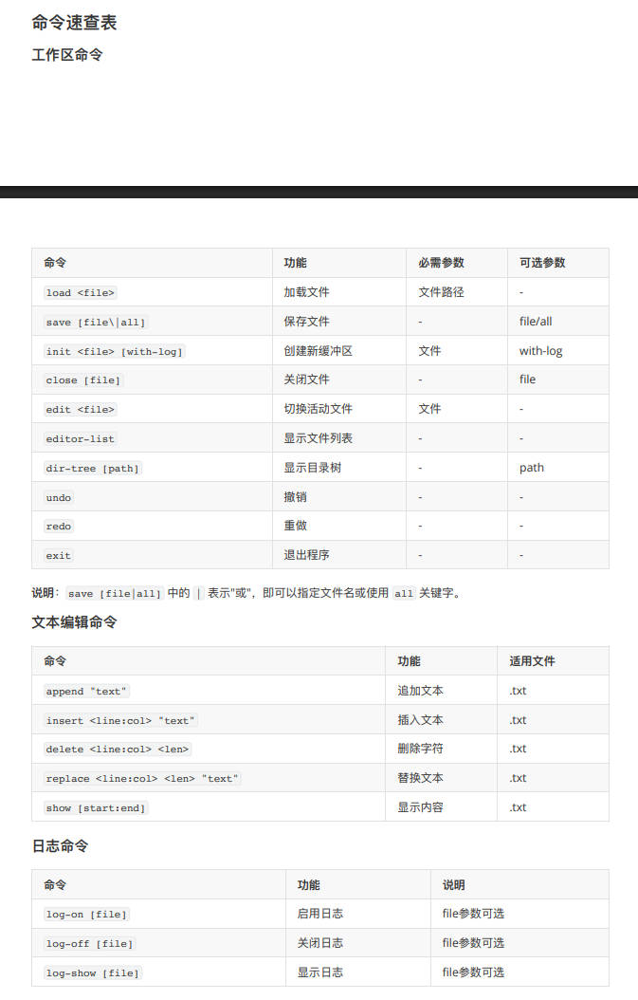
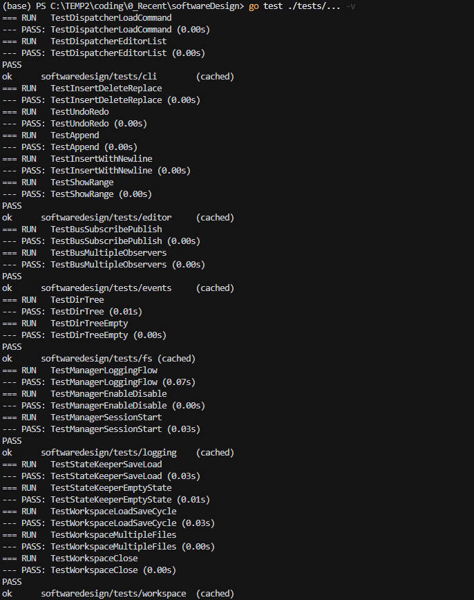
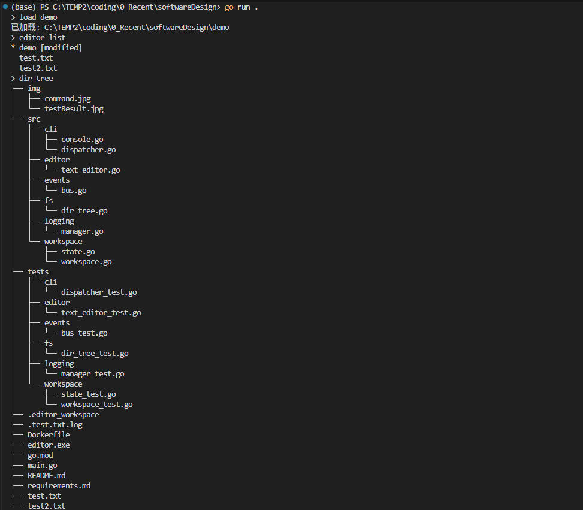
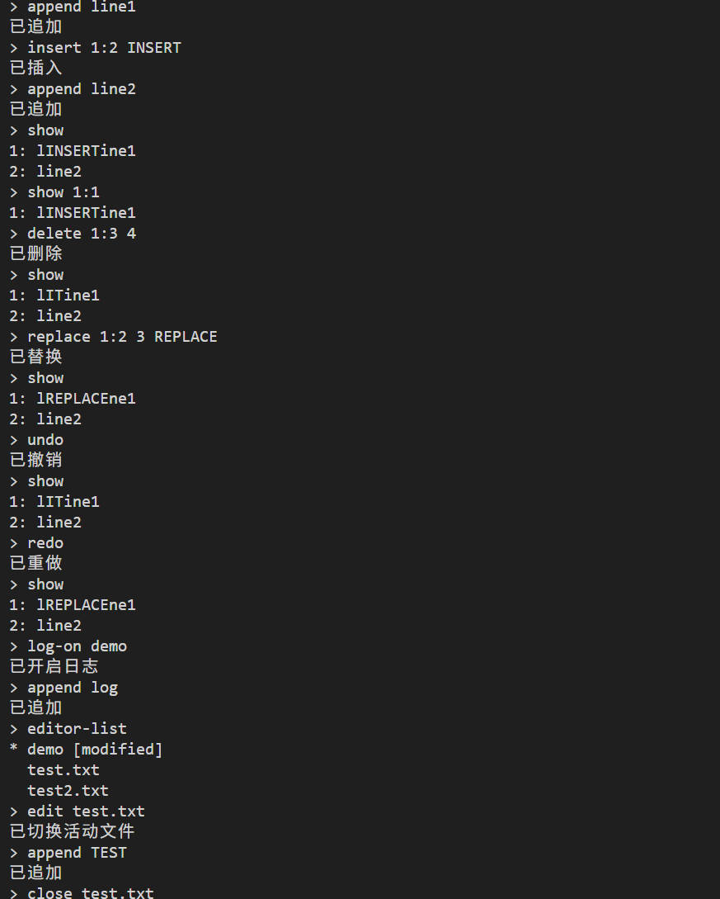
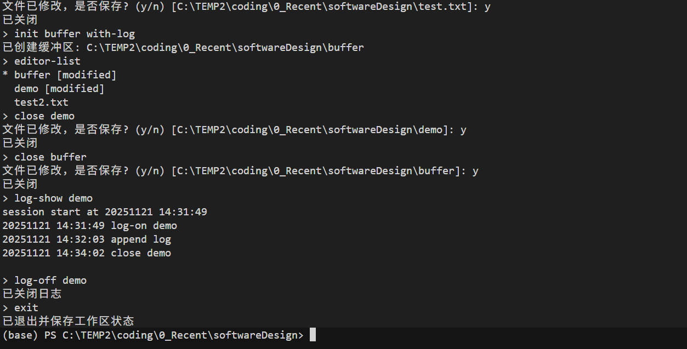
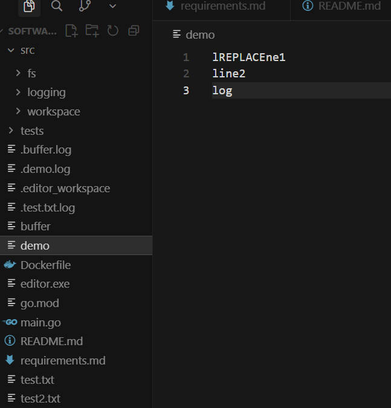
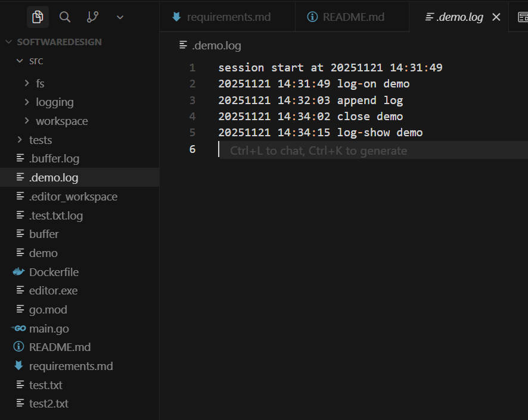

## 文本工作区 CLI

用Go语言的1.22.5版本完成本次Lab，符合 Lab1 要求的命令行文本编辑器工作区。它管理多个缓冲区，持久化工作区状态，提供按文件日志记录等所有要求的功能

### 架构概览
- **CLI (`internal/cli`)**: 命令解析器/分发器以及控制台提示器。应用解释器 + 外观模式思想，将输入处理与业务逻辑分离。
- **工作区 (`internal/workspace`)**: 协调编辑器、状态持久化（通过 `StateKeeper` 实现备忘录模式）、观察者（发布事件）和依赖协调。依赖接口（`SaveDecider`）实现防御性设计。
- **编辑器 (`internal/editor`)**: 基于行存储的文本缓冲区，编辑命令和撤销/重做栈（命令模式配合内部状态快照）。
- **日志 (`internal/logging`)**: 观察者模式实现，监听工作区事件并写入 `.filename.log` 文件，处理会话分隔。
- **文件系统辅助 (`internal/fs`)**: 负责确定性的 `dir-tree` 输出。
- **事件 (`internal/events`)**: 工作区和日志模块共享的轻量级事件总线。

### 设计亮点
- **观察者模式**: `events.Bus` 在命令完成时通知 `logging.Manager`，保持日志解耦。
- **命令 + 备忘录模式**: 每个编辑器变更捕获前后快照，实现撤销/重做而不泄露缓冲区内部结构。
- **防御性工作区**: 所有文件路径解析为绝对路径，保存时自动创建目录，通过 `SaveDecider` 抽象提示。
- **状态持久化**: `.editor_workspace` 记录打开的文件、活动编辑器、修改标志和日志开关，满足重启要求。

### 支持的命令
`load`, `save [file|all]`, `init <file> [with-log]`, `close [file]`, `edit <file>`, `editor-list`, `dir-tree [path]`, `undo`, `redo`, `exit`, `append "text"`, `insert <line:col> "text"`, `delete <line:col> <len>`, `replace <line:col> <len> "text"`, `show [start:end]`, `log-on [file]`, `log-off [file]`, `log-show [file]`.



### 使用方法
```bash
# 安装依赖
go mod tidy

# 运行交互式编辑器
go run .

# 运行各层测试
go test ./...
```

### 测试结果

__自动化测试__



__用户测试__





